# May 10th: finished the z axis.
since this is a rebuild of my old corexy, i needed to use the same length of rod i had. which is 400mm. im just gonna use wtver i have leftover. so it will have an e3v6 hotend, a 5010 or 5015 i forgot. a 4010 for hotend cooling, nema4401 for evrything, and a full metal bowden extruder. i could design to be direct drive too. 235x235 heatbed. also gonna be using a bltouch

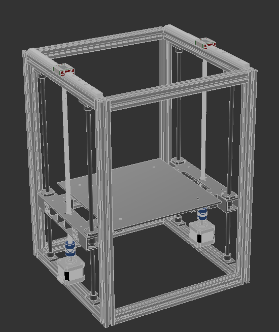
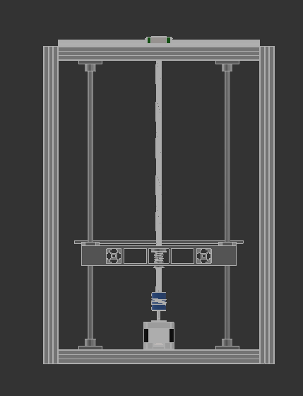
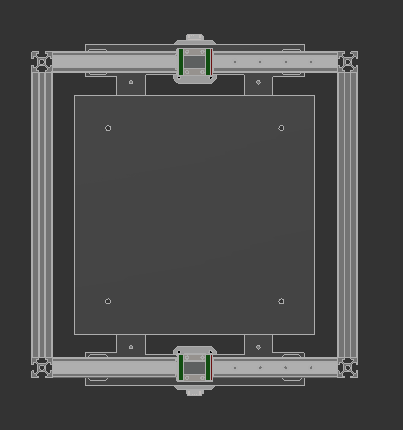

- https://lapse.hackclub.com/timelapse/GtvCkwPp_xdz 

**Total time spent: 1h 57m**

# May 12th: finished the xy axis.
this took alotta time, as i randomly jsut had burnout in the middle of making this. so i tried making it minimal filament required as possible. i also added 2 tensioners. ill be using 20t pulleys. it loooks good and i thing i just needa finish the toolhead and after that we will be done. 

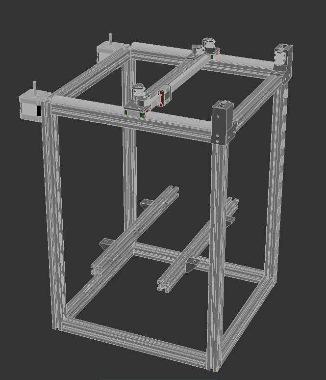
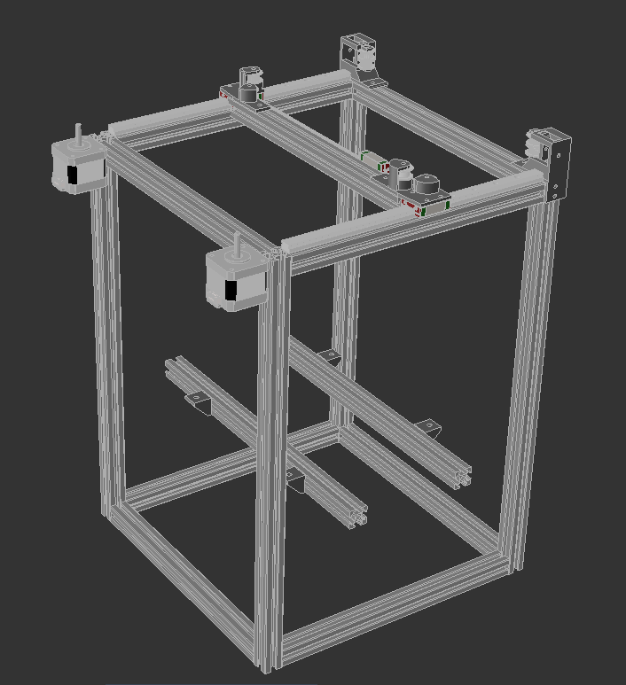
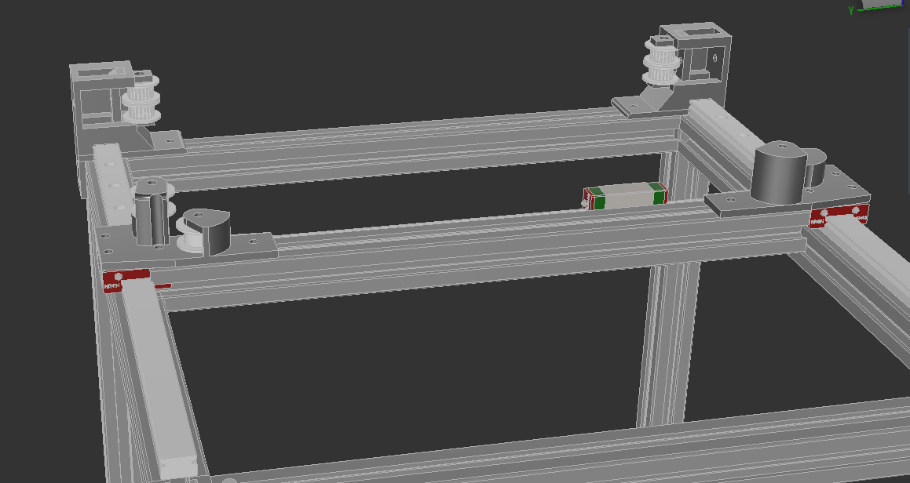

- https://lapse.hackclub.com/timelapse/ifyR0RdkuCwI

**Total time spent: 2h 2m**

# May 14th: finished the printer!
alr so i took a quick break, and after the break i finished the printer. i made mounts for the xy motors and the z motors. after that im gonna be using a bowden extruder, and a 5015 fan for part cooling. my hotend comes with a heat creep fan so idont need another one. ill be using klipper with this. 

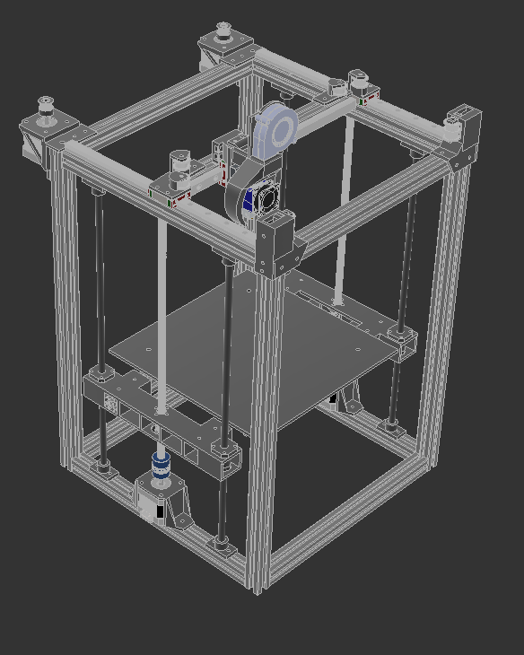
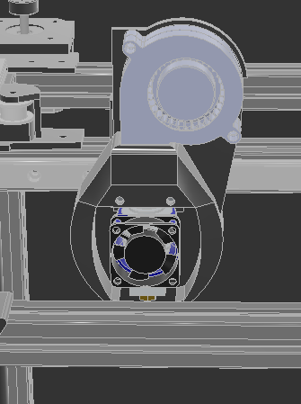

ill rq add the endstops. i also forgot to add the bltouch mount.. bruh so i had to increase the size of the frame.by 60 mms. heres the new frame.

alr so i finished it and [heres](https://a360.co/4wAPMd2) the link.

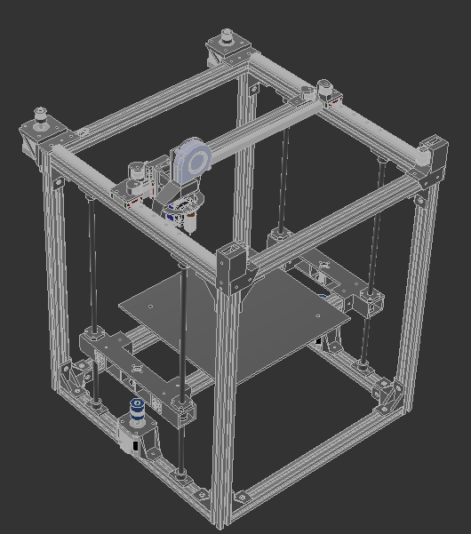
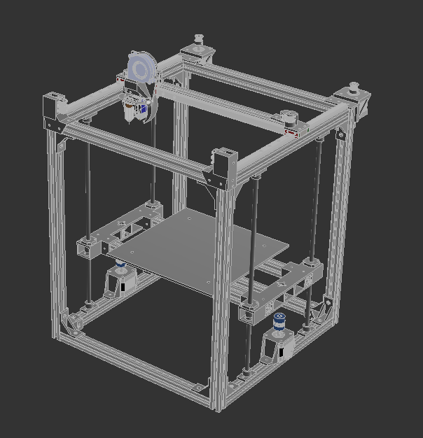

ima color ts too. the colors didnt download bruh.

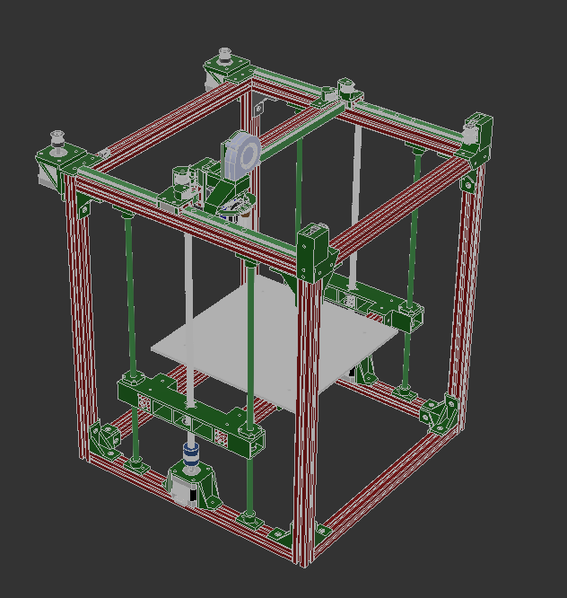

also made the [bom](https://docs.google.com/spreadsheets/d/1zhgAOG6omMPHL8-E59rT1NqycOJV-DbqdpBb1aLMfEA/edit?usp=sharing)

- https://lapse.hackclub.com/timelapse/Gw56jiP1FX1r
- https://lapse.hackclub.com/timelapse/BCfBmr-IPPyY

**Total time spent: 2h 30m**

